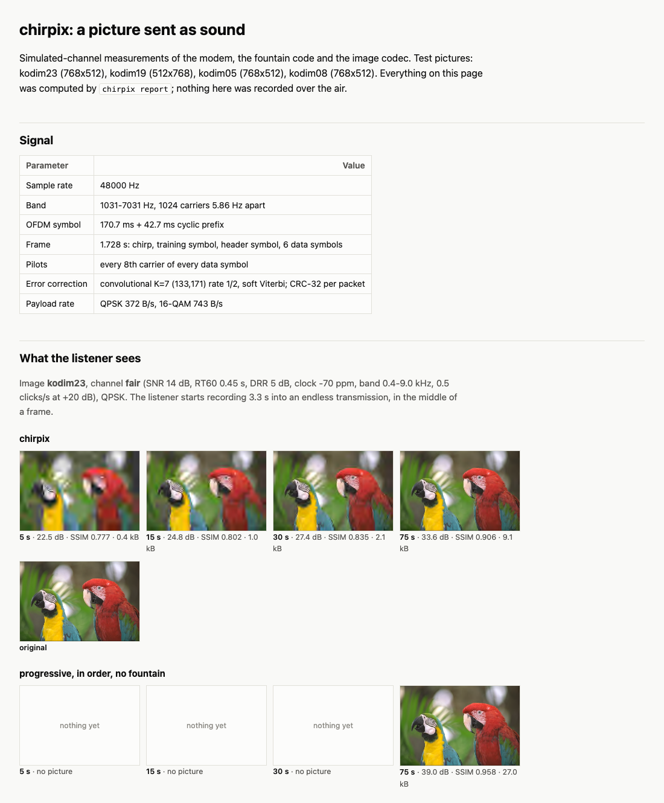
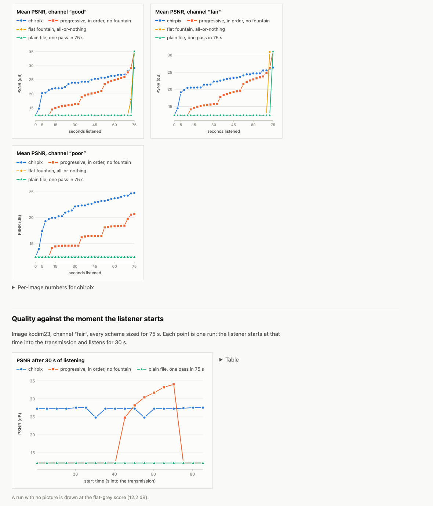

# chirpix

Send a picture through the air as sound. One device plays a WAV file through its loudspeaker; another
records it with a microphone; the recording decodes back to the picture. The modem, the error-correcting
codes, the image codec and the WAV/PNG file code are all in this repository, in Rust, with no dependencies
outside the standard library.

Sending data as sound is old and well served (see [Related work](#related-work)); **this is a learning
rebuild, not a new idea**. It is modelled on the UC Berkeley EE123 final project (send the best picture you
can over an audio channel in 75 seconds). What it tries to do well is the joint design of three layers so
that

- **the picture sharpens the longer you listen**, instead of appearing only when a file is complete, and
- **it does not matter when you start listening** or which stretches you miss,

and then to measure honestly what that costs.

> **Status of the evidence.** Every number below comes from a *simulated* loudspeaker-room-microphone
> channel. The signal has also been played and recorded through the real macOS audio stack via a virtual
> loopback device (no acoustic path). It has **not** been tested through a real loudspeaker and microphone.

[繁體中文說明](README.zh-TW.md) · [Design notes](docs/DESIGN.md) · [給初學者的導讀](docs/導讀.zh-TW.md)



## Results at a glance

Four Kodak test photographs (768x512), an ordinary simulated room ("fair": SNR 14 dB in band, RT60 0.45 s,
direct-to-reverberant ratio 5 dB, recorder clock 70 ppm slow, occasional clicks), the listener starting at
four arbitrary moments. Mean PSNR over RGB / SSIM on luma; in brackets, how many of the 16 runs had any
picture. A run without a picture scores as a flat grey image (12.4 dB / 0.41).

| Same modem, codec and audio time; only packet scheduling differs | 5 s | 15 s | 30 s | 75 s |
|---|---|---|---|---|
| **chirpix** (windowed fountain, 9.1 kB stream) | 19.1 dB / 0.48 (16) | 20.5 / 0.51 (16) | 22.3 / 0.57 (16) | 26.4 / 0.74 (16) |
| Progressive stream sent in order, repeated | 12.4 / 0.41 (0) | 14.6 / 0.44 (4) | 15.7 / 0.48 (4) | 31.1 / 0.87 (16) |
| Ordinary fountain code, shown when complete | (0) | (0) | (0) | 30.9 / 0.87 (16) |
| Plain 27 kB file, one pass in 75 s | (0) | (0) | (0) | **31.1 / 0.87** (16) |

Read it both ways. Up to a minute chirpix is the only scheme that reliably shows anything. At 75 s on a
channel that loses nothing, **the plain file wins by 4.7 dB**: it spends all its airtime on new data, while
chirpix spends two thirds of it making the early layers arrive early (the limit behind this is in
[DESIGN.md](docs/DESIGN.md#unequal-protection-and-what-it-costs)).

On the "poor" channel (SNR 10 dB, RT60 0.6 s, as much echo as direct sound, clicks, a recorder that drops
audio, 18% of packets lost) the order reverses at every time: chirpix 17.4 / 20.0 / 22.2 / 24.8 dB with a
picture in 13, 16, 16, 16 of 16 runs; the plain file never completes within 75 s; the in-order stream
reaches 20.7 dB.



The lower chart is the second claim: after 30 s of listening, chirpix gives 24.8 to 27.6 dB whenever the
listener starts; the in-order stream gives a picture only if the 30 s happen to include the start of its
loop (and then a better one, up to 34 dB).

All of this is reproduced by `make data && make report` (about 90 s on four cores of an Apple M5 shared
with other jobs), which writes a self-contained `out/report/report.html`.

## Try it

```
make build          # needs Rust 1.82+ (https://rustup.rs)
make test           # 73 tests, about 15 s
make demo           # small report on built-in pictures -> out/demo/report.html
make data report    # four Kodak photographs (2.8 MB, SHA-256 checked) and the full report
```

On macOS, double-click `跑跑看.command` for a guided run (messages in Traditional Chinese).

One picture, by hand (real output; `simulate` stands in for the room):

```
$ chirpix encode data/kodim23.png -o tx.wav
image        data/kodim23.png  768x512
mode         QPSK rate 1/2, 372 bytes/s of payload
stream       9095 bytes in 85 packets (Windowed scheme, sized for 75 s of listening)
layers       0.4 kB, 1.0 kB, 2.0 kB, 3.3 kB, 5.1 kB, 9.1 kB (each decodable on its own, coarsest first)
audio        tx.wav : 92.1 s, 53 frames of 1.728 s, 48 kHz 16-bit mono

$ chirpix simulate tx.wav -o rx.wav --channel fair --skip 7.3 --rate 44100
channel      SNR 14 dB, RT60 0.45 s, DRR 5 dB, clock -70 ppm, band 0.4-9.0 kHz, 0.5 clicks/s at +20 dB
recording    rx.wav : 84.8 s at 44100 Hz (started 7.3 s into the transmission)

$ chirpix decode rx.wav -o decoded --every 15 --ref data/kodim23.png
recording    rx.wav: 84.8 s at 44100 Hz, 1 channel(s)
frames       48 found, first at 1.59 s
signal       QPSK, 85 source packets, scheme Windowed
quality      10.1 dB per carrier, recorder clock -72 ppm, packets ok 288/288
advice       stay with --mode robust (16-QAM needs about 12 dB)

  seconds  packets  stream bytes  picture
     15.0       46           963  decoded/t0015.png  PSNR 24.81 dB  SSIM 0.8020
     30.0       97          2033  decoded/t0030.png  PSNR 27.29 dB  SSIM 0.8339
     45.0      150          3317  decoded/t0045.png  PSNR 29.05 dB  SSIM 0.8627
     60.0      202          5136  decoded/t0060.png  PSNR 30.79 dB  SSIM 0.8788
     75.0      253          9095  decoded/t0075.png  PSNR 33.57 dB  SSIM 0.9059  [complete]
     84.8      288          9095  (unchanged)  PSNR 33.57 dB  SSIM 0.9059
```

### Over the air (not verified by the author)

Two devices: play `tx.wav` on one (any player), record on a phone with any recorder app for 30 s or more,
starting whenever you like; copy the recording back and run `chirpix decode recording.wav`. If the recorder
wrote something other than WAV, convert first (macOS: `afconvert -f WAVE -d LEI16 in.m4a out.wav`). Keep
both devices still: symbols are 0.17 s long and movement during a symbol hurts.

One Mac: `swift scripts/audio_loop.swift --play tx.wav --record rx.wav` plays through the current output
and records from the current input (macOS asks for microphone permission once), then `chirpix decode rx.wav`.
`跑跑看.command` offers this as its last, optional step.

What has been verified is the same helper with both ends pointed at the BlackHole virtual device
(`make loopback`): 36.8 s of audio through CoreAudio at the device's 44.1 kHz, 126/126 QPSK packets and
252/252 16-QAM packets recovered, picture complete at the 30 s it was sized for. That exercises playback,
capture, sample-rate conversion and an unsynchronised start; it has no loudspeaker, room or microphone in it.

## How it works

```
picture ── codec ──► embedded byte stream ── fountain ──► endless packet sequence ── modem ──► audio
           wavelet,     any prefix decodes     6 windows,    packet n is a fixed       OFDM, 1.7 s
           bit-planes                          XOR mixes     function of n             frames
```

- **Modem.** OFDM at 48 kHz, 1024 carriers 5.86 Hz apart in 1.03-7.03 kHz, 171 ms symbols with a 43 ms
  cyclic prefix. Each 1.728 s frame is self-contained: a chirp for detection and timing, a training symbol,
  a heavily repeated header, six data symbols each carrying one code block (K=7 rate-1/2 convolutional
  code, soft Viterbi, CRC-32). Pilots on every eighth carrier measure the clock offset per frame; the
  recording is then resampled and decoded a second time. QPSK gives 372 B/s of payload, 16-QAM 743 B/s.
- **Fountain code.** Packet `n` is the XOR of source packets chosen by `n`. Six nested windows over the
  start of the stream get fixed shares of the packets, so the start is recovered first. The receiver solves
  the equations by Gaussian elimination and uses the longest known prefix.
- **Image codec.** YCbCr, 9/7 wavelet, bit-planes coded through quadtrees with an adaptive binary range
  coder. The stream is embedded: cut it anywhere and it decodes.

[docs/DESIGN.md](docs/DESIGN.md) has the frame format, the reasoning and the dead ends.

## Measurements

From `out/report/report.html` after `make data report`. Each figure is one simulated run or a mean of
runs with fixed seeds; they are not confidence intervals.

**Against theory, white noise only.** Es/N0 is the signal-to-noise ratio per carrier.

| | Uncoded BER 1e-2: textbook | modem | Coded BER 1e-4: ideal receiver | modem | Implementation loss | Packet loss < 1% from |
|---|---|---|---|---|---|---|
| QPSK | 7.2 dB | 8.6 dB | 3.4 dB | 4.1 dB | 0.7 dB | 4.5 dB |
| 16-QAM | 13.9 dB | 15.4 dB | 8.5 dB | 10.0 dB | 1.5 dB | 10.5 dB |

"Ideal receiver" is the same mapping, soft-bit rule and Viterbi decoder with perfect timing and channel
knowledge; it sits on the published union bound for this code. The uncoded column is the first pass, before
decoded blocks are fed back as extra training. Cyclic prefix, pilots and frame overhead cost another 2.9 dB
of transmitted energy that these figures do not include.

**Where it breaks** (share of packets delivered, QPSK / 16-QAM, one impairment at a time):

| Impairment | Fine up to | Degraded | Gone |
|---|---|---|---|
| White noise (in-band SNR) | 6 dB / 10 dB | 4 dB: 90% / 8 dB: 6% | 2 dB / 6 dB |
| Echo, RT60 0.5 s, by direct-to-reverberant ratio | −6 dB / +5 dB | −10 dB: 88%, −15 dB: 46% / 0 dB: 95%, −3 dB: 15% | — / −6 dB |
| Reverberation time at DRR 0 dB | 0.8 s / 0.3 s | 1.2 s: 97% / 0.5 s: 92% | 2.0 s: 6% / 0.8 s |
| Recorder clock offset | ±400 ppm / ±400 ppm | −1000 ppm: 100% / 0% | +1000 ppm, ±2000 ppm |
| Low-pass corner (band top is 7.0 kHz) | 5.5 kHz | 5.0 kHz: 67% / 66% | 4.0 kHz |
| High-pass corner (band bottom is 1.0 kHz) | 3.0 kHz (highest tried) | | |
| Clipping (× RMS; own peaks are 3.4×) | 0.3× / 1.0× | — / 0.7×: 91%, 0.5×: 20% | — / 0.3× |
| Clicks per second (3 ms, +20 dB) | 10 / 2 | 20: 99% / 5: 97%, 10: 82% | — / 20: 24% |
| Dropouts per minute (50 ms deleted) | 0 | 6: 82%, 15: 62%, 30: 33% | 120: 6% |

Dropouts are the weak point: deleting 50 ms shifts everything after it, and the rest of that 1.7 s frame is
lost.

**Why 171 ms symbols.** The first design used 21 ms symbols with a 5 ms cyclic prefix and delivered nothing
once echo was as strong as the direct sound. Same modem, four symbol lengths, RT60 0.45 s (QPSK / 16-QAM
delivered):

| Symbol + prefix | QPSK rate | DRR +5 dB | 0 dB | −5 dB | −10 dB |
|---|---|---|---|---|---|
| 21 + 5 ms | 465 B/s | 100% / 0% | 0% / 0% | 0% / 0% | 0% / 0% |
| 43 + 11 ms | 456 B/s | 100% / 0% | 10% / 0% | 0% / 0% | 0% / 0% |
| 85 + 21 ms | 424 B/s | 100% / 98% | 99% / 0% | 2% / 0% | 0% / 0% |
| 171 + 43 ms (used) | 372 B/s | 100% / 100% | 100% / 96% | 100% / 8% | 85% / 0% |

**Choosing QPSK or 16-QAM.** There is no return channel. The rule: QPSK, unless a test recording decoded by
`chirpix decode` reports 12 dB per carrier or more. On the "good" channel (reported 20 dB) that picks 16-QAM
and the 75 s picture is 29.2 dB instead of 26.4 dB. The rule is conservative: on "fair" (10 dB) it picks
QPSK although 16-QAM also got through there.

**Codec alone.** kodim23 at 24 kB: 38.2 dB; at 9.1 kB: 33.6 dB; at 0.4 kB: 22.5 dB. It was not compared
with JPEG 2000 or any other codec.

## Limitations

- **No over-the-air result.** The simulator leaves out loudspeaker distortion, automatic gain control and
  noise suppression in recorders, lossy audio compression and movement. Any of them may dominate.
- The band (1-7 kHz) was chosen from general knowledge of small loudspeakers and voice recorders, not from
  measurements of any device.
- It is audible and unpleasant: 6 kHz of noise-like signal with a sweep every 1.7 s.
- Low rate: 372 B/s (QPSK). A 768x512 photograph gets 9 kB in 75 s, about 26 dB on average.
- The first picture is very coarse (0.4 kB) and needs two whole frames: typically 4-5 s, sometimes more.
- Long symbols make it sensitive to movement and to clock offsets beyond ±600 ppm.
- A recorder dropout loses the rest of that frame. A streaming (real-time) receiver, an ultrasonic mode and
  an analogue SSTV baseline were not built.
- The decoder reads the first channel of a multi-channel recording and needs WAV input.
- Pictures larger than 1024 pixels on a side are shrunk before encoding.

## Related work

- [quiet](https://github.com/quiet/quiet) (on liquid-dsp) and [amodem](https://github.com/romanz/amodem) are
  working OFDM/QAM audio modems; [ggwave](https://github.com/ggerganov/ggwave) is a robust multi-tone FSK
  protocol with Reed-Solomon coding; [minimodem](https://github.com/kamalmostafa/minimodem) implements the
  classic FSK standards. They carry bytes or files reliably. chirpix is slower and less proven than any of
  them; what it adds is the layering above the modem.
- [Fldigi](http://www.w1hkj.com/) and analogue SSTV send pictures over audio channels in amateur radio.
  SSTV degrades gracefully with noise but takes a fixed time per picture and has no notion of joining late.
- Fountain codes: LT (Luby 2002), Raptor/RaptorQ (RFC 6330). Unequal protection by expanding windows is from
  Sejdinovic, Vukobratovic, Doufexi, Senk and Piechocki, "Expanding window fountain codes for unequal error
  protection" (IEEE Trans. Commun., 2009), which also evaluates it for progressive video. Using it under a
  progressive image coder is their idea, not mine.
- Embedded wavelet coding: EZW (Shapiro 1993), SPIHT (Said and Pearlman 1996), EZBC, JPEG 2000. The codec
  here is a small member of that family.

To my knowledge there is no other open project that puts an expanding-window fountain and a progressive
codec on an acoustic modem and reports quality against listening time and start time; I have not searched
exhaustively, and each ingredient is standard.

## Build and test

```
make build     cargo build --release
make test      unit tests (each block) + end-to-end tests through the simulated channel
make lint      rustfmt, clippy -D warnings, shell syntax
make demo      quick report on generated pictures (what CI runs)
make report    full report (uses data/ if `make data` was run)
make loopback  macOS only: through the BlackHole virtual audio device, silent; skips if unavailable
```

CI runs build, lint, tests and the quick report on Linux, and the tests on macOS. Test pictures are
generated at test time; nothing binary is committed.

## License

MIT. The Kodak pictures fetched by `make data` are not part of this repository.
